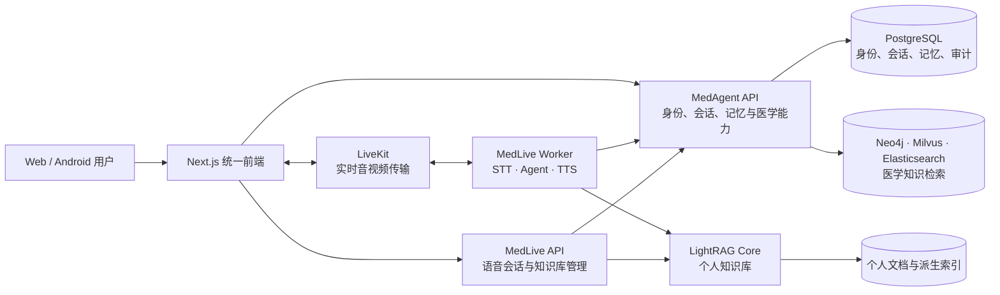
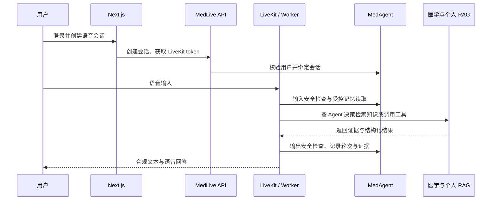

# MedAgent

[](https://www.python.org/)
[](https://nextjs.org/)
[](https://fastapi.tiangolo.com/)

MedAgent 是一个面向医疗咨询与个人健康知识管理的多模态 Agent 平台。当前仓库把网页端、实时语音 Agent、医学能力服务、个人知识库和统一数据治理整合在同一套系统中：用户可以通过文字或语音交互，Agent 按需检索医学知识与个人资料、调用医疗工具，并在回答前后执行安全检查与证据追踪。

> 本项目用于辅助信息检索与健康沟通，不替代医生诊断、处方或紧急医疗服务。

## 系统全景



| 子系统 | 主要职责 | 入口 |
| --- | --- | --- |
| `frontend` | 登录、文字/语音交互、知识库与证据展示 | Next.js，默认 `http://localhost:3000` |
| `medlive` | LiveKit 实时语音 Worker、会话控制 API、个人 LightRAG 服务 | `medlive-agent`、`medlive-api`、`medlive-rag-service` |
| `medrag` | 身份与租户隔离、文字对话、医学 RAG、工具、安全、记忆与审计 | `medrag.app.server:app`，默认 `http://localhost:8000` |
| `medcontracts` | MedLive 与 MedAgent 之间共享的请求、证据和错误契约 | Python 包 |

## 核心能力

- **文字与实时语音统一体验**：Next.js 前端同时接入 MedAgent HTTP API 和基于 LiveKit 的双向语音链路。
- **Agent 工具调用**：检索医学知识和个人知识库，并调用剂量计算、科室导诊和检查指标查询工具。
- **双知识域检索**：公共医学知识由 Neo4j、Milvus、Elasticsearch 混合检索提供；用户私有文档由独立的多知识库 LightRAG 服务管理。
- **安全与可追溯回答**：输入与输出均经过医疗安全检查，检索结果携带证据、来源、置信度和请求链路信息。
- **受控记忆**：短期上下文、会话摘要、长期事实和用户偏好写入统一数据层，医学事实支持确认、拒绝、更正、导出与删除。
- **身份和租户隔离**：浏览器用户、语音会话和 Worker 通过 JWT、短时 Worker token、scope、nonce 与幂等键绑定。
- **可降级运行**：外部检索源、模型或工具故障被隔离，健康状态、超时和错误信封保持一致。

## 一次语音问答如何流转



医学知识和个人资料属于两个不同的信任域。`medlive-worker` 负责实时对话和工具决策，但身份、受控记忆、医学安全与审计仍由 `medrag` 掌握；个人知识库通过 `medlive-api` 校验所有权后再访问内部 LightRAG 服务。

## 技术栈

| 层次 | 技术 |
| --- | --- |
| 前端 | Next.js 15、React 19、TypeScript、Tailwind CSS、LiveKit Components |
| API 与 Agent | Python 3.10+、FastAPI、LiveKit Agents、OpenAI-compatible LLM clients |
| 语音 | LiveKit、火山引擎 STT、StepFun / DashScope TTS（按配置启用） |
| 个人知识库 | LightRAG，多知识库物理隔离，文档与索引任务管理 |
| 医学检索 | Neo4j KG、Milvus ANN、Elasticsearch BM25、RRF 与 Cross-Encoder |
| 数据与部署 | PostgreSQL、独立持久卷、Docker Compose |

## 快速启动

需要 Docker Engine、Docker Compose v2，以及实际使用的模型与语音 Provider 凭据。

```powershell
Copy-Item deploy/.env.phase5.example deploy/.env.phase5
Get-ChildItem deploy/secrets/*.example | ForEach-Object {
    Copy-Item $_.FullName ($_.FullName -replace '\.example$', '')
}
```

编辑 `deploy/.env.phase5` 和 `deploy/secrets/` 下新生成的文件。配置门禁会拒绝默认占位密钥；生产环境应把 `*_SECRET_FILE` 指向仓库外的 secret store。

日常开发推荐 `voice`，它会启动 PostgreSQL、迁移任务、MedAgent API、LightRAG、MedLive API/Worker、LiveKit 和前端：

```powershell
docker compose --env-file deploy/.env.phase5 --profile voice config --quiet
docker compose --env-file deploy/.env.phase5 --profile voice up -d --build
```

需要本地运行 Milvus、Elasticsearch 和 Neo4j 时使用完整配置：

```powershell
docker compose --env-file deploy/.env.phase5 --profile full config --quiet
docker compose --env-file deploy/.env.phase5 --profile full up -d --build
```

| 地址 | 用途 |
| --- | --- |
| `http://localhost:3000` | 统一 Web 前端 |
| `http://localhost:8000/docs` | MedAgent OpenAPI |
| `http://localhost:8000/health` | MedAgent 健康状态 |
| `http://localhost:9821/docs` | MedLive 管理 API |
| `http://localhost:9821/health` | MedLive 健康状态 |

Compose 默认只把用户入口绑定到 `127.0.0.1`，PostgreSQL 和内部 LightRAG 不发布宿主端口。公网或跨主机部署需要补齐 TLS、反向代理、防火墙、TURN、集中日志与异地备份。

## 本地开发

```powershell
uv sync --all-extras
uv run uvicorn medrag.app.server:app --host 127.0.0.1 --port 8000 --reload
uv run medlive-rag-service
uv run medlive-api
uv run medlive-agent dev
```

```powershell
Set-Location frontend
Copy-Item .env.example .env.local
pnpm install
pnpm dev
```

`frontend/.env.local` 中的 `MEDAGENT_API_BASE` 和 `MEDLIVE_API_BASE` 必须指向本地后端。完整配置项见 `.env.example`、`frontend/.env.example` 与 `deploy/.env.phase5.example`。

## 仓库结构

```text
MedAgent/
├── src/
│   ├── medrag/          # 医学能力、身份、会话、记忆、安全与公共知识检索
│   ├── medlive/         # 实时语音 Agent、管理 API 与个人 LightRAG 服务
│   └── medcontracts/    # 跨服务共享契约
├── frontend/            # Next.js 统一前端
├── deploy/              # 镜像、编排、迁移、检查、备份与恢复
├── scripts/             # 数据库 schema 与医学知识索引脚本
├── tests/               # 单元、集成、安全、迁移和部署验收测试
├── eval/                # RAGAS 评测、golden cases 与报告
├── data/                # 医学数据处理与训练样本
├── compose.yaml         # voice / full 一体化编排
└── pyproject.toml       # Python 包、入口命令与可选依赖
```

建议按 `compose.yaml` → `src/medlive/main.py` → `src/medlive/api/server.py` → `src/medrag/app/server.py` → `src/medcontracts/phase0.py` 阅读主干。共享契约文件名为兼容历史保留，不代表系统仍按阶段拆分运行。

## API 边界

- **MedAgent 用户面**：`/auth`、`/chat`、`/sessions`、`/documents`、`/memories`。
- **MedAgent 控制面**：`/control/v1`，负责知识库所有权、语音会话和 Worker token。
- **MedAgent 内部能力**：`/internal/v1`，提供安全检查、医学检索、医疗工具、语音轮次审计与受控记忆读取。
- **MedLive 管理面**：`/voice`、`/model`、`/prompt`、`/session`、`/rag`。
- **LightRAG 内部面**：`/v1/knowledge-bases/...`，仅供携带内部 API key 的服务访问。

## 测试与运维

```powershell
uv run pytest
Set-Location frontend
pnpm build
```

部署前还应执行迁移 dry-run、服务预热、HTTP smoke、租户隔离测试以及备份/恢复演练。详细命令与生产约束见 [部署与运维手册](docs/operations/phase5-deployment.md)。历史设计与交接材料位于 `docs/plans/` 和 `docs/handoffs/`；当前事实以代码、`compose.yaml` 和本 README 为准。

## 数据来源与许可

医学检索实验数据包含 [Open-KG 疾病知识图谱](http://data.openkg.cn/dataset/disease-information) 与 [cMedQA2](https://github.com/zhangsheng93/cMedQA2)。迁入的 LiveRAG 与前端代码保留 MIT 许可；具体适用范围和完整文本见 [THIRD_PARTY_NOTICES.md](THIRD_PARTY_NOTICES.md) 与 `licenses/`。
