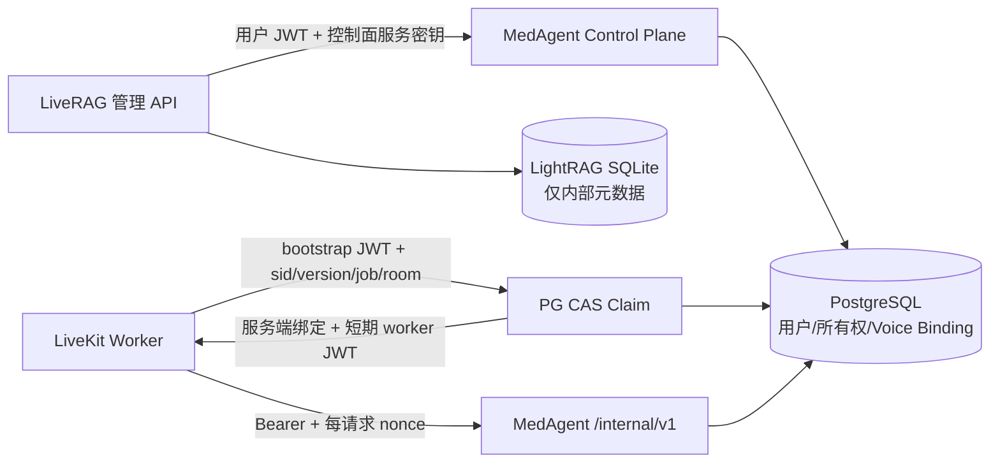

# MedAgent × LiveRAG 阶段 1 交接记录

日期：2026-09-01  
阶段：身份与数据基础  
状态：**No-Go；Voice Session 生命周期整改已完成，待复验**；真实语音仍未验收，不得据此进入 Phase 2
提交：本文件所在的 Phase 1 验收整改提交（本地，不 push）

## 边界与保留项

1. 两个仓库仍位于 `D:\MedAgent` 与 `D:\LiveRAG`，没有迁仓。
2. MedAgent 用户原有未提交内容继续保留且不纳入本轮提交：
   - `src/medrag/config/settings.py`
   - `fastapi-startup.err`
   - `fastapi-startup.log`
   - `handoff.md`
3. 旧 `user_credentials.json` 仅作为一次性导入源读取，不删除、不覆盖、不回写。
4. 阶段 0 的四个 `/internal/v1` 能力路径、冻结 envelope、超时与幂等键保持兼容。
5. LightRAG SQLite 只保留知识库内部元数据；知识库所有权与 Voice Session 绑定的授权事实源为 PostgreSQL。

## 整改后的权威数据流

- LiveRAG 不再使用 SQLite 的 `owner_user_id` 做授权判断。
- LiveRAG worker 不再导入、实例化或查询 `VoiceSessionStore`。
- LiveRAG 不再自签 worker token；token 只由 MedAgent 根据已 claim 的 PostgreSQL 绑定签发。
- 控制面所有权/会话变更同时要求用户 JWT 与独立的 `MEDAGENT_CONTROL_PLANE_KEY`，防止用户绕过 LiveRAG 抢注 `kb_id`。

## 已完成

### 用户身份与迁移契约

- PostgreSQL `users.user_id UUID` 为稳定身份主键，访问 JWT 使用 `sub=user_id`。
- 新增 `normalized_username`、`status`、`token_version`。
- 用户名使用 Unicode NFKC、去除首尾空白并 `casefold`；数据库最终建立唯一索引并设置 NOT NULL。
- 迁移会检测大小写和 Unicode 等价冲突；冲突时停止启动并在凭据文件旁生成 `phase1_user_migration_conflicts.json`。
- 登录只允许 `status=active`；每个访问 JWT 带 `ver`，请求时必须与数据库 `token_version` 一致。
- 旧明文密码只在内存中升级为 bcrypt 后写入 PostgreSQL，旧文件保持原样。

### PostgreSQL 知识库所有权

新增 `knowledge_base_ownership`：

- `kb_id` 为主键；
- `owner_user_id` 外键指向 `users.user_id`；
- `status` 表示业务可见状态；
- 列表、详情、修改、删除、文档、任务、预览和查询的授权均先查询 PostgreSQL；
- 删除前先收紧 PostgreSQL 状态，内部删除失败时恢复为 active；
- SQLite 中的 owner 字段不再参与授权。

本阶段冻结的是“PostgreSQL 为所有权授权事实源”这一边界。完整的跨 PostgreSQL、
SQLite 和文件系统状态机（`provisioning → ready → deleting → deleted/error`）明确后移，
不在本次小范围生命周期整改中扩展；当前仍使用 `active/deleted` 与即时补偿。

### Voice Session 服务端绑定

- 用户创建会话时，LiveRAG 先通过受保护控制面在 PostgreSQL 预建 binding。
- PostgreSQL 记录 `session_id`、`user_id`、`knowledge_base_id`、`room_name`、`binding_version`、`livekit_job_id` 及客户端元数据。
- room metadata 只包含 `session_id + binding_version`。
- 只发给 Agent dispatch 的 metadata 额外包含短期 bootstrap JWT；bootstrap JWT 不含 `user_id` 或 `kb_id`。
- worker 以 `session_id + expected binding_version + room_name + livekit_job_id` 调用 claim；PostgreSQL 通过状态、版本和空 job 条件执行一次性 CAS。
- claim 成功后版本递增并写入 job；重复 claim、版本不匹配、room 不匹配或已结束会话均拒绝。
- worker 后续只使用 claim 响应中的服务端绑定和 MedAgent 签发的短期 token。
- 会话结束时状态和 `binding_version` 再次更新，使现有 worker token 立即失去有效 binding。
- `created/active` 会话均带 PostgreSQL `lease_expires_at`；claim 同时写入 active lease。
- worker 在 claim 后立即注册幂等释放回调；AgentSession 成功启动后才启动后台 heartbeat。初始化失败时不会留下孤儿 heartbeat，并由释放回调与 lease 到期双重兜底。
- heartbeat 独立于医疗能力调用，通过 `/worker/token` 同时续租并轮换短期 token。
- finalizer 第一优先级是结束 PostgreSQL binding；history 压缩失败只记录结果，不再阻止结束。
- MedAgent cleanup 将过期 `created/active` 转为 `expired` 并递增版本，从而释放“每用户一个开放会话”的唯一索引。
- LiveRAG 启动及后台 cleanup loop 均调用受服务密钥保护的 PostgreSQL cleanup 接口；创建新会话前仓储也会回收过期 lease。

### worker metadata 默认 fail-closed

下列情况默认拒绝启动 Agent：

- room/job metadata 缺失；
- metadata 不是合法 JSON；
- 缺少 `session_id`、`binding_version` 或 bootstrap token；
- 实际 room 缺失；
- PostgreSQL claim 失败；
- 绑定的知识库不存在或不可用。

仅当环境为 `dev` 或 `test`，并显式设置 `LIVERAG_ALLOW_UNBOUND_WORKER=true` 时，才允许旧的无绑定开发模式。生产环境即使误设该开关也不会降级。

### turn、evidence、审计与防重放

PostgreSQL 表：

- `voice_turns`
- `evidence`
- `audit_events`
- `worker_request_nonces`

能力请求必须：

- 使用 audience/scope/sid/kid/jti/exp 完整的短期 worker JWT；
- 先验证对应 PostgreSQL binding 已 claim、仍为 active 且 user/kb 一致；
- 每个 HTTP 请求携带新的 UUID `X-Request-Nonce`；
- 通过 `(token_jti, nonce)` 主键原子消费 nonce，重复请求返回 `REPLAY_DETECTED`；
- 审计详情排除 `text`、`query`、`content`，不保存完整病例或模型原文。

bootstrap token 的重放由 PostgreSQL claim CAS 拒绝；worker token 默认 300 秒，
后台 heartbeat 默认每 30 秒通过受保护接口续租并轮换，不依赖通话期间是否发生医疗能力调用。

### 旧全局接口封闭

以下 LiveRAG 接口现在要求管理员身份；匿名请求被拒绝，普通用户写入返回 403：

- `/model/config`
- `/model/context-config`
- `/model/effective-state`
- `/prompt/soul`
- `/session/messages`
- `/session/rag-context`
- `/session/turns`
- `/session/clear`
- `/rag/config`

`/runtime/state` 仍允许已登录用户读取，但会移除属于其他用户的 active session 与 active voice state。

## 关键配置

两端：

- `JWT_SECRET_KEY`：访问 JWT、bootstrap JWT 和 worker JWT 的强随机签名密钥。
- `MEDAGENT_CONTROL_PLANE_KEY`：LiveRAG 管理服务调用 MedAgent 控制面变更接口的独立强随机服务密钥。
- `MEDAGENT_CONTROL_BASE_URL`：可选；默认回退到 `MEDAGENT_INTERNAL_BASE_URL`，再回退到 `http://127.0.0.1:8000`。
- `MEDAGENT_VOICE_SESSION_CREATED_LEASE_SECONDS`：created lease，默认 120 秒。
- `MEDAGENT_VOICE_SESSION_LEASE_SECONDS`：active lease，默认 120 秒。
- `LIVERAG_WORKER_HEARTBEAT_SECONDS`：worker 后台续租间隔，默认 30 秒，应显著小于 active lease。

生产：

- `MEDAGENT_ALLOW_LEGACY_INTERNAL_API_KEY` 保持 false 或不配置。
- `LIVERAG_ALLOW_UNBOUND_WORKER` 保持 false 或不配置。

## 关键文件

MedAgent：

- `scripts/phase1_identity_data.sql`
- `src/medrag/infrastructure/storage/phase1_repository.py`
- `src/medrag/app/auth_manager.py`
- `src/medrag/app/dependencies.py`
- `src/medrag/app/worker_auth.py`
- `src/medrag/app/api/control_v1.py`
- `tests/test_phase1_identity_data.py`
- `tests/test_auth_security.py`

LiveRAG：

- `liverag/control_plane.py`
- `liverag/security.py`
- `liverag/voice/session.py`
- `liverag/api/server.py`
- `liverag/main.py`
- `liverag/agent/tool/medical_client.py`
- `tests/test_phase1_identity.py`

## 部署与升级顺序

1. 备份 PostgreSQL、LiveRAG SQLite、知识库目录、索引和旧凭据文件。
2. 执行 `scripts/phase1_identity_data.sql`，随后启动 MedAgent，让 `ensure_schema()` 完成用户名规范化、冲突报告和唯一索引。
3. 若生成 `phase1_user_migration_conflicts.json`，停止部署并人工解决冲突；不得跳过或自动合并。
4. 两端配置相同的强 `JWT_SECRET_KEY`，并配置相同的独立 `MEDAGENT_CONTROL_PLANE_KEY`。
5. 先启动 PostgreSQL 与 MedAgent，再启动 LiveRAG 管理 API/RAG 服务，最后启动 LiveKit worker。
6. 通过 LiveRAG 创建新知识库；创建成功后必须能在 PostgreSQL `knowledge_base_ownership` 查到 owner。
7. 对部署前已有知识库，使用受保护控制面按确认后的真实 owner 做一次性登记；不要再以 SQLite owner 字段作为授权依据。
8. 创建 Voice Session 后确认 PostgreSQL 先出现 status=created 和 created lease；worker 启动后确认同一记录变为 active、job 被写入、version 增加且 heartbeat 持续延长 lease。
9. 停止 worker 或停止 heartbeat，等待 lease 到期并运行 cleanup；确认状态转为 expired，且同一用户可以创建新会话。
10. 确认生产未开启 legacy internal key 或 unbound worker 开关。

## 验证结果

MedAgent Phase 1/认证定向：

    27 passed, 1 warning

MedAgent 全量：

    229 passed, 11 failed, 1 warning

11 个失败与整改前一致，位于本轮未修改的旧模块：

- `tests/test_eval_script.py`：7 个；
- `tests/test_memory_system.py`：2 个；
- `tests/test_query_routing_cases.py`：1 个；
- `tests/test_resilience.py`：1 个。

LiveRAG 全量：

    uv run pytest -q
    38 passed, 2 warnings

    uv run ruff check liverag tests
    All checks passed!

静态与格式：

- 两仓 Python `compileall` 通过；
- MedAgent 本轮修改文件 ruff 通过；
- 两仓 `git diff --check` 在修正文档后通过。

PostgreSQL 16 隔离真实实例：

- migration 连续执行两次成功，验证幂等；
- LiveKit job CAS 首次 claim 数量为 1，使用相同 `binding_version` 重复 claim 数量为 0；
- 过期 active lease 被更新为 expired；
- 过期会话释放唯一索引后，同一用户成功插入新的 created 会话；
- 验收事务已回滚；
- 临时容器使用 `--rm`，验收后停止并自动删除。

## 明确未完成：真实语音验收

**真实语音验收没有完成，也没有被声明为通过。**

当前仍缺少 LiveKit、真实 STT、Voice LLM、TTS 等外部凭据，因此本轮只完成代码、HTTP 契约、PostgreSQL migration/CAS、token/nonce 与离线测试。

凭据提供后仍必须完成：

1. 启动 PostgreSQL、MedAgent、LiveRAG 管理 API/RAG service、LiveKit worker 和真实语音 provider。
2. 用两个真实用户验证知识库、文档、查询和 Voice Session 全链路互不可见。
3. 抓取真实 worker 请求，核对 claim、短期 token、轮换和每请求 nonce。
4. 重放同一 bootstrap claim，确认 CAS 拒绝；重放同一 Bearer + nonce，确认 PostgreSQL 防重放拒绝。
5. 用实际音频复验阶段 0 急症旁路、安全 TTS、医学检索、个人库和三个确定性工具。
6. 采集首响、100 turn、15 分钟并发/稳定性与审计表对账数据。

在上述真实凭据验收完成前，不得把“真实麦克风音频”“真实 provider”或“生产端到端”标记为已验收。
