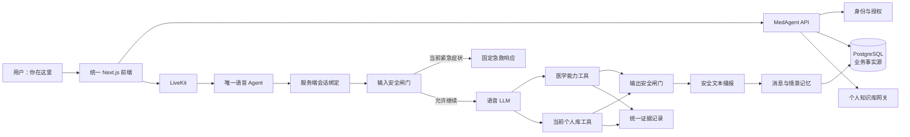

# MedAgent × LiveRAG 融合实施计划 v2

## 总结

采用“先稳定服务契约，再迁入主仓”的路线：

- 阶段 0 保持 `D:\MedAgent` 与 `D:\LiveRAG` 原位，通过 HTTP 完成最小语音闭环。
- 契约稳定后，以 `D:\MedAgent` 为主仓，但保留 `medrag` 医疗领域与 `medlive` 实时语音两个独立 Python 包。
- LiveKit 语音 LLM 是唯一语音编排者；MedAgent 提供 retrieval-only 医学能力、安全检查和医疗工具。
- PostgreSQL 是用户、所有权、会话、消息、证据和记忆的最终事实来源；SQLite 仅保存 LightRAG 内部元数据。
- 所有长期关联使用不可变 `user_id`，不以用户名作为外键或目录名。
- 医学库和个人资料不按来源硬编码优先级；冲突由证据属性判断，无法安全消解时明确展示。
- 安全链路覆盖输入、生成输出以及 TTS 前最后一跳。



## 核心架构与接口

### 服务和包边界

契约验证阶段不移动源码。迁仓完成后的目标结构为：

```text
src/
  medcontracts/   # 请求、证据、错误和事件契约
  medrag/         # 医疗领域、鉴权、记忆、文字 ReAct、业务 API
  medlive/        # LiveKit worker、个人 RAG、语音上下文、运行态
frontend/         # 统一 Next.js 前端
frontend-legacy/  # 临时保留的旧 Vue 页面
```

运行时保持四个独立进程：

- MedAgent API。
- LiveKit 语音 worker。
- LightRAG Core。
- Next.js 前端。

语音 worker 不直接连接医学数据库、PostgreSQL 或 LightRAG SQLite，只调用受保护的服务契约。

### 内部能力 API

版本固定为 `/internal/v1`，统一返回 `request_id`、`status`、`data`、`metrics` 和结构化 `error`：

- `POST /internal/v1/safety/input-check`
- `POST /internal/v1/safety/output-check`
- `POST /internal/v1/medical/retrieve`
- `POST /internal/v1/medical/tools/execute`
- `GET /internal/v1/voice/sessions/{session_id}/binding`
- `POST /internal/v1/voice/sessions/{session_id}/turns`
- `POST /internal/v1/voice/sessions/{session_id}/finalize`

能力请求携带 `session_id`、`turn_id` 和幂等键；后端根据服务端绑定解析 `user_id` 和 `kb_id`，不信任 worker 自报的用户身份。

语音工具固定为：

- `search_medical_knowledge`
- `search_personal_knowledge_base`
- `calculate_dosage`
- `guide_department`
- `lookup_normal_range`

默认硬超时：

| 能力 | 硬超时 | 失败行为 |
|---|---:|---|
| 输入安全检查 | 400ms | 进入安全降级响应，不继续自由生成 |
| 医学检索 | 1500ms | 明确医学资料暂不可用 |
| 个人库检索 | 2000ms | 不影响医学工具 |
| 确定性医疗工具 | 500ms | 不允许模型伪造计算结果 |
| 单句输出检查 | 400ms | 未检查文本不得进入 TTS |

### 统一证据契约

每条证据至少包含：

```text
evidence_id
turn_id
source_type: medical / personal
fact_type
subject_scope: user_specific / general
source_category
source_id
document_id
title
content_preview
authority_level
verification_status
observed_at
valid_from
valid_to
version
score
confidence
request_id
latency_ms
created_at
```

证据冲突按以下顺序处理：

1. 先区分用户客观数据、通用医学知识、诊疗建议和个人笔记。
2. 用户本人的检查结果不能被通用人群描述覆盖。
3. 个人资料不能被提升为通用医学事实。
4. 比较来源权威性、用户特异性、时间、版本、有效状态和置信度。
5. 涉及诊断、处方、剂量或禁忌且无法可靠消解时，不自动选边；展示冲突、来源和核实建议。
6. 删除原文后，证据仅保留审计所需的 ID、来源类别、哈希、时间和评分，清除可还原原文的片段。

## 身份、数据与记忆

### 不可变用户身份

新增 PostgreSQL `users` 表：

```text
user_id UUID/ULID PRIMARY KEY
username
normalized_username UNIQUE
password_hash
display_name
is_admin
status
created_at
updated_at
```

- JWT 使用 `sub=user_id`，同时携带 token version；用户名只用于登录和展示。
- 知识库、病例、会话、消息、记忆、证据全部引用 `user_id`。
- 文件路径仅使用系统生成 ID，例如 `/data/personal-rag/{user_id}/{kb_id}/`。
- 现有 JSON 用户通过幂等迁移脚本导入 PostgreSQL并保留 bcrypt hash；切换后要求重新登录。
- 大小写或 Unicode 规范化后冲突的用户名停止迁移并生成报告，不自动合并账户。

### Voice Session 绑定

Room metadata 只包含：

```json
{
  "session_id": "vs_xxx",
  "binding_version": 1
}
```

worker 使用短期内部 JWT 获取绑定：

- 通过受限 worker client credential 换取 5 分钟 token。
- token 固定 audience，并按需授予 `voice:binding:read`、`medical:capability:invoke`、`voice:turn:write`。
- 绑定接口核对数据库中的 session 状态、room name、binding version 和 LiveKit agent job ID。
- 首次绑定采用原子 compare-and-set；相同 job 重试幂等，不同 job 或旧 binding version 拒绝。
- 恢复失败会话必须由服务端增加 binding version，不能重放旧 session metadata。
- 每位用户最多一个活跃语音会话，不限制其他用户并发。

### PostgreSQL 与 SQLite 边界

- PostgreSQL：用户、知识库所有权、知识库业务状态、Voice Session 绑定、消息、证据、记忆和审计。
- SQLite：LightRAG 文档、索引任务和引擎内部元数据。
- 文件目录：原始文件和 LightRAG 派生索引。
- 所有 `/rag/knowledge-bases/{kb_id}/*` 请求必须先用 JWT `user_id` 查询 PostgreSQL 所有权，再访问 LightRAG。
- 知识库创建和删除采用状态机 `provisioning → ready → deleting → deleted/error`，使用幂等键解决 PostgreSQL、SQLite和文件系统无法共享事务的问题。

### 受控记忆模型

记忆分为四层：

- 工作记忆：当前会话和最近消息，写入 PostgreSQL；JSONL 仅作 worker 短期缓冲。
- 情景记忆：会话结束后异步生成 session summary。
- 医疗事实记忆：仅从用户原话和可信个人文档提取候选。
- 用户偏好：表达方式等稳定偏好，和医疗事实分表。

医疗事实表包含：

```text
memory_id
user_id
memory_type
content
structured_value
status: proposed / confirmed / superseded / rejected
source_type
source_session_id
source_turn_id
source_document_id
valid_from
valid_to
confidence
supersedes_memory_id
created_at
updated_at
```

写入规则：

- 助手回复、推测性诊断和模型摘要不得直接成为用户医疗事实。
- 否定、历史事件、第三人称和科普问题不得按关键词直接写入。
- 高风险事实先写为 `proposed`；经用户确认或可信文档验证后才能变成 `confirmed`。
- 召回默认只注入 `confirmed` 事实；`proposed` 仅用于确认界面。
- 纠正事实时创建新版本，并在同一事务中把旧版本标记为 `superseded`。
- 会话 finalize 使用 `(session_id, summary_version)` 唯一键，重复结束不会重复生成摘要或记忆。
- 只有 PostgreSQL 情景摘要闭环完成后，才能停用 LiveRAG history 压缩。
- 提供记忆查询、确认、拒绝、纠正、删除和导出 API。

## 安全语音链路

### 输入安全闸门

输入风险判断至少区分：

- 当前本人症状。
- 他人症状。
- 历史事件。
- 否定表达。
- 科普提问。
- 症状是否持续。
- 儿童、孕妇、老人等特殊人群。

“胸痛是什么”不得等价于“我现在胸痛”；无法确定是否为当前急症时，先进行简短澄清。

确认是当前红色急症时：

- 不调用 LLM、RAG 或医疗工具。
- 直接使用固定、可审计的急救响应。
- 不提供远程诊断和自行用药建议。

### 输出安全闸门

LLM 文本不得逐 token 直接送入 TTS：

1. 按完整句子或安全长度片段缓冲。
2. 检查诊断确定性、危险剂量、禁忌建议、急症弱化、证据冲突和必需提示。
3. 通过后才进入 TTS。
4. 不通过则丢弃该片段并替换为安全措辞。
5. 检查超时或服务异常时，未经检查的文本不得播出，改用固定降级响应。

每个 turn 保存原始模型文本的受限审计版本、安全检查结果、最终播报文本及规则版本；普通用户接口只返回最终安全文本。

个人文档内容始终作为不可信数据处理，其中的指令、角色声明和提示词不得改变 Agent 或安全规则。

## 分阶段交付

### 阶段 0：契约验证

- 两个仓库保持原位。
- MedAgent 提供 retrieval-only 医学接口和输入/输出安全接口。
- LiveRAG worker 通过 HTTP 调用医学能力。
- 跑通唯一语音 Agent、双知识工具、统一证据、句级 TTS 安全缓冲。
- 冻结 OpenAPI、错误码、超时和幂等语义后再迁仓。

### 阶段 1：身份与数据基础

- 建立 PostgreSQL 用户表和 `user_id` 迁移。
- 建立知识库所有权、Voice Session 绑定、turn、evidence 和审计表。
- JWT 切换到 `sub=user_id`。
- 实现短期 worker token、作用域和绑定防重放。
- 建立 PostgreSQL 授权网关与 LightRAG 内部事实边界。

### 阶段 2：安全语音闭环

- 完成输入语义风险识别和红色急救旁路。
- 接入五个语音工具及独立降级。
- 完成句级输出检查和 TTS 前闸门。
- 所有消息、证据和安全记录用 `turn_id` 关联。
- 完成冲突证据展示，不实施硬编码来源优先级。

### 阶段 3：记忆闭环

- 统一写入 PostgreSQL 消息。
- 会话结束幂等生成情景摘要。
- 从用户原话和可信文档提取医疗事实候选。
- 完成确认、拒绝、纠正、版本替代、删除和导出。
- 验证替代链路后停用 LiveRAG 独立 history。

### 阶段 4：迁仓与统一前端

- 将稳定模块迁入 `medlive`，共享契约放入 `medcontracts`。
- 以 LiveRAG Next.js 为基础接入登录、文字、语音、个人库、证据和记忆管理。
- 旧 Vue 移到 `/legacy`，不再挂载根路径。
- 保留 LiveRAG MIT 许可证和来源声明，不导入 Git 历史。
- 保留 MedAgent 当前未提交修改，不覆盖无关文件。

### 阶段 5：部署与运维

- Compose 编排 API、worker、LiveKit、LightRAG、Next.js、PostgreSQL、Milvus、Elasticsearch 和 Neo4j。
- 使用 profiles 区分最小语音环境和完整医学检索环境。
- 完成数据卷、备份、恢复、预热、健康检查、导出和删除说明。
- 部署切换前执行数据库备份、迁移 dry-run 和回滚演练。

## 测试与验收

### 正确性与安全

- “胸痛是什么”不触发当前急症旁路。
- “我现在胸痛而且呼吸困难”不调用 LLM/RAG，直接播报急救响应。
- “我没有青霉素过敏”不会写成青霉素过敏。
- 助手生成的诊断猜测不会进入医疗事实记忆。
- 新旧事实通过 `superseded` 串联，不直接覆盖。
- 重复 finalize 不重复写消息、摘要、证据或记忆。
- 伪造、过期、跨 room 或重放 session 绑定全部拒绝。
- 用户不能访问其他用户的知识库、会话、证据或记忆。
- 个人文档提示词注入不能改变 Agent 和安全规则。
- 输出检查失败或超时，不会有原始模型文本进入 TTS。
- 删除知识库后保留最小审计元数据，但删除证据原文和可还原片段。
- 用户可以查询、确认、纠正、拒绝、删除和导出自己的记忆。

### 性能口径

“首响”定义为：

> 从 STT final 事件产生，到客户端开始播放第一段通过输出安全检查的有效 TTS 音频。

同时记录 STT final、输入安全完成、工具开始/结束、LLM 首句完成、输出检查完成、首音频生成、客户端首帧播放时间。

预热环境验收目标：

| 场景 | p50 | p95 |
|---|---:|---:|
| 无工具首响 | ≤1.2s | ≤2.0s |
| 单工具首响 | ≤2.0s | ≤3.5s |
| 红色急救响应 | — | ≤800ms |

- 每个场景至少采集 100 个有效 turn。
- 分别验证 2、5、10 个并发语音会话，10 并发持续至少 15 分钟。
- 报告缓存状态、知识库规模、模型/provider、部署地域和网络条件。
- 并发测试期间不得出现跨用户数据、未检查 TTS、重复 finalize 或失效绑定。
- 除端到端指标外，分别报告各工具超时率、输出闸门耗时和首音频生成耗时。

## 明确边界

- MVP 不合并 LightRAG 与医学索引，也不做多个人库 fan-out。
- MVP 不提供语音 ReAct/快速模式切换。
- 不迁移 LiveRAG 现有 SQLite、history 和个人知识库数据。
- 文字端暂时保留 MedAgent ReAct，但共享新的身份、证据和受控记忆机制。
- 契约验证未通过前，不迁移 LiveRAG 源码、不替换前端、不停用现有 history。
